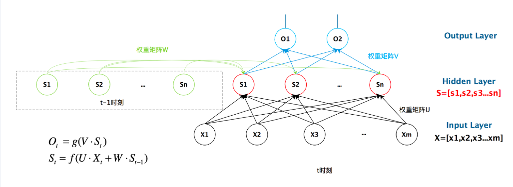
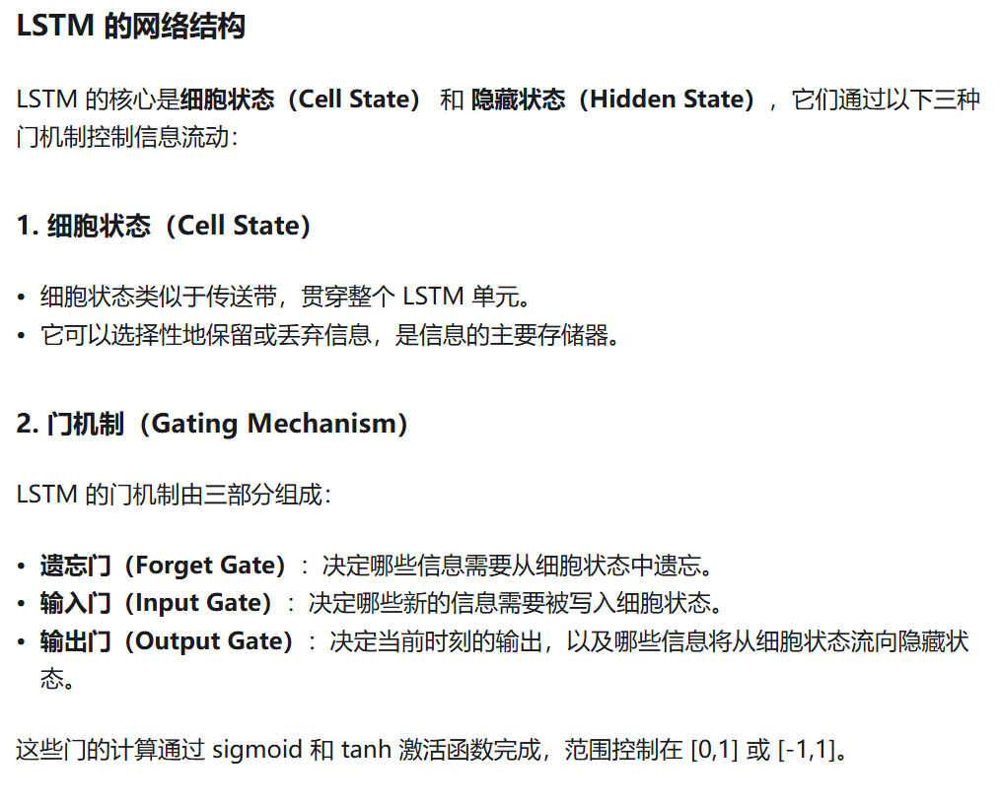
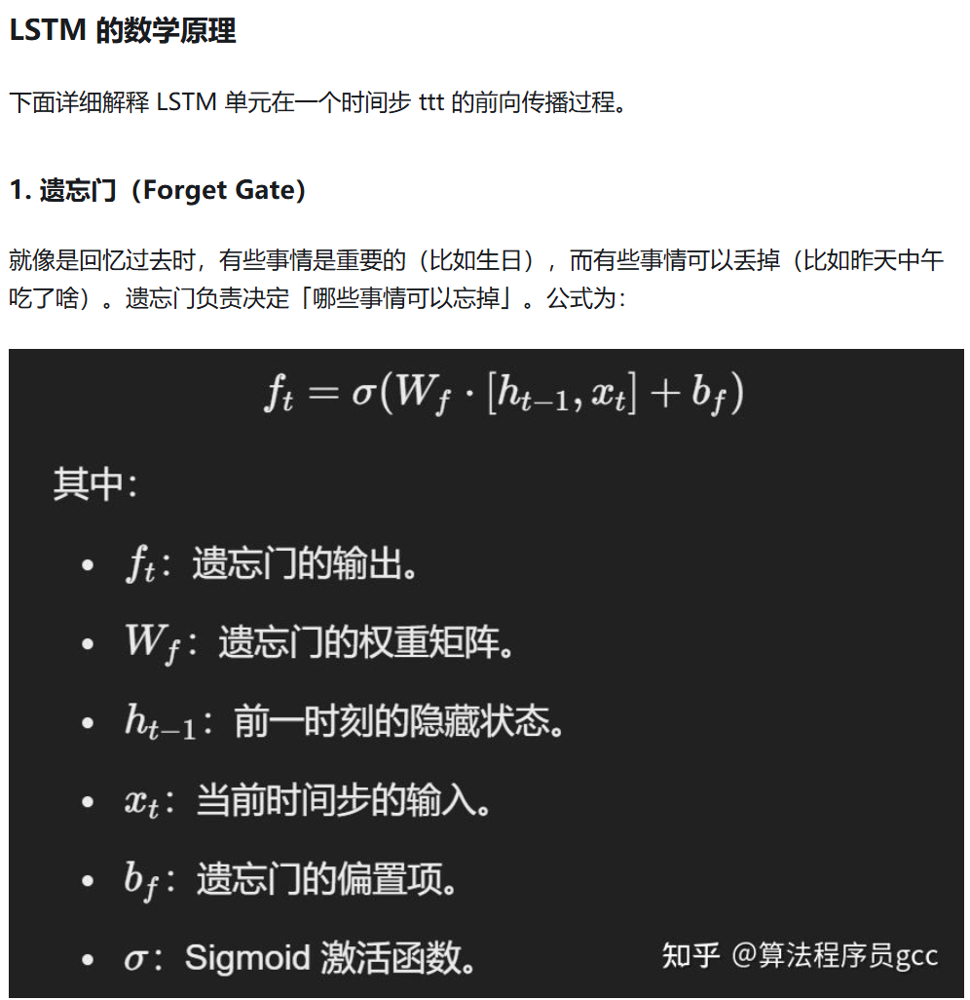
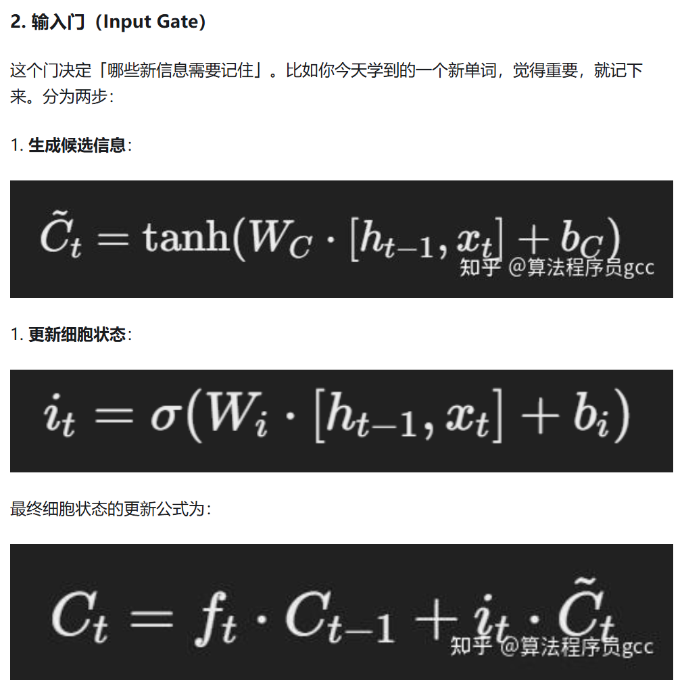
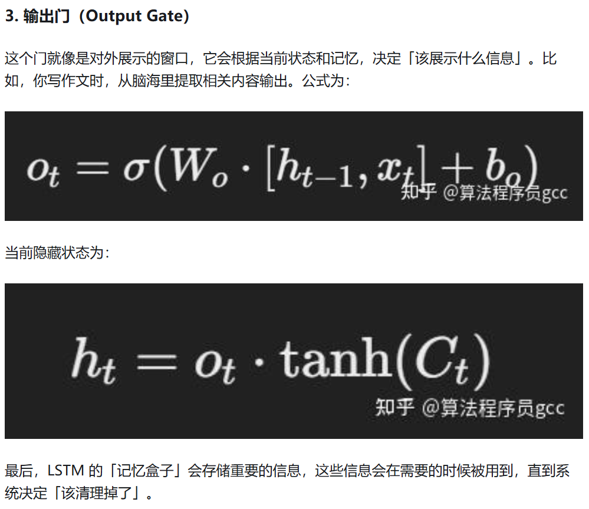

# 创建专用环境
conda create -n dl-learning python=3.10
conda activate dl-learning

# 安装PyTorch套件
conda install pytorch==2.5.1 torchvision==0.20.1 torchaudio==2.5.1 pytorch-cuda=12.1 -c pytorch -c nvidia

# RNN



## RNN在时间维度上共享权重矩阵,即 图示W、U、V

# LSTM






# transformer
### 基本架构


# Transformer 每个结构实现文档

### 1. **attention.py**
**核心功能**：实现多头自注意力机制（Multi-Head Self-Attention）

**主要类**：
- `SelfAttention`：多头自注意力层

**关键张量形状**：
- 输入：`(batch_size, seq_len, embed_size)`
- 输出：`(batch_size, seq_len, embed_size)`
- 注意力分数：`(batch_size, heads, query_len, key_len)`

**注意力掩码**：
- 形状：`(batch_size, 1, query_len, key_len)` 或 `None`
- 作用：屏蔽无效位置（0=屏蔽，1=保留）

---

### 2. **TransformerBlock.py**
**核心功能**：实现标准的Transformer块（用于编码器）

**主要类**：
- `TransformerBlock`：单个Transformer层

**关键张量形状**：
- 输入：`(batch_size, seq_len, embed_size)`
- 输出：`(batch_size, seq_len, embed_size)`
- Q/K/V：形状相同

**处理流程**：
1. 自注意力 → 残差连接 → 层归一化
2. 前馈网络 → 残差连接 → 层归一化

---

### 3. **Encoder.py**
**核心功能**：实现完整的Transformer编码器

**主要类**：
- `Encoder`：堆叠多个TransformerBlock

**关键张量形状**：
- 输入（token IDs）：`(batch_size, seq_length)`
- 输出：`(batch_size, seq_length, embed_size)`

**组件**：
- 词嵌入：将token ID → 向量
- 位置编码：学习的位置嵌入
- Transformer块：N层堆叠

---

### 4. **DecoderBlock.py**
**核心功能**：实现解码器块（包含两种注意力）

**主要类**：
- `DecoderBlock`：单个解码器层

**关键张量形状**：
- 输入x：`(batch_size, trg_seq_len, embed_size)`
- 编码器输出：`(batch_size, src_seq_len, embed_size)`
- 输出：`(batch_size, trg_seq_len, embed_size)`

**两种注意力**：
1. **带掩码自注意力**（目标序列自身）
   - 掩码：`trg_mask`，屏蔽未来位置和padding
2. **编码器-解码器注意力**（交叉注意力）
   - Query来自解码器，Key/Value来自编码器
   - 掩码：`src_mask`，屏蔽源序列padding

**两种掩码**：
- `src_mask`：`(batch_size, 1, 1, src_len)` - 屏蔽源序列padding
- `trg_mask`：`(batch_size, 1, trg_len, trg_len)` - 因果掩码 + padding屏蔽

---

### 5. **Decoder.py**
**核心功能**：实现完整的Transformer解码器

**主要类**：
- `Decoder`：堆叠多个DecoderBlock

**关键张量形状**：
- 输入（token IDs）：`(batch_size, trg_seq_len)`
- 输出：`(batch_size, trg_seq_len, vocab_size)`

**组件**：
- 词嵌入 + 位置编码
- N层DecoderBlock
- 输出线性层（投影到词汇表）

**Teacher Forcing**：
- 训练时使用：`trg[:, :-1]` 作为输入
- 预测：`trg[:, 1:]` 作为目标

---

### 6. **Transformer.py**
**核心功能**：完整的Transformer模型（编码器+解码器）

**主要类**：
- `Transformer`：端到端Transformer

**关键张量形状**：
- 输入src：`(batch_size, src_len)`
- 输入trg：`(batch_size, trg_len)`
- 输出：`(batch_size, trg_len, trg_vocab_size)`

**掩码生成方法**：
- `make_src_mask()`：生成源序列padding掩码
- `make_trg_mask()`：生成目标序列因果掩码

**工作流程**：
1. 编码器处理源序列 → 上下文表示
2. 解码器基于编码器输出 + 目标序列 → 生成预测
3. 输出词汇表上的概率分布

---

##  模块依赖关系

```
Transformer (整体模型)
├── Encoder (编码器)
│   └── TransformerBlock (N层)
│       └── SelfAttention (注意力)
└── Decoder (解码器)
    ├── DecoderBlock (N层)
    │   ├── SelfAttention (带掩码)
    │   └── TransformerBlock (交叉注意力)
    └── 输出线性层
```

---

### **两种掩码**：

| 掩码 | 形状 | 用途 | 应用位置 |
|------|------|------|----------|
| `src_mask` | `(batch_size, 1, 1, src_len)` | 屏蔽源序列padding位置 | 编码器自注意力、编码器-解码器注意力 |
| `trg_mask` | `(batch_size, 1, trg_len, trg_len)` | 1) 因果掩码（屏蔽未来位置）<br>2) 屏蔽目标序列padding | 解码器自注意力 |

### **训练与推理**：

**训练**（Teacher Forcing）：
- 解码器输入：`<sos> + 序列[:-1]`
- 解码器目标：`序列[1:] + <eos>`

**推理**（自回归生成）：
- 逐步生成：输入已生成部分，预测下一个token
- 使用因果掩码确保只能看到前面位置

---


---

## 张量shape变化

```
编码器：
输入: (2, 9)           # [batch, src_len]
嵌入后: (2, 9, 512)    # [batch, src_len, embed_size]
输出: (2, 9, 512)      # 编码后的上下文表示

解码器：
输入: (2, 7)           # [batch, trg_len-1] (teacher forcing)
嵌入后: (2, 7, 512)    # [batch, trg_len, embed_size]
输出: (2, 7, 10000)    # [batch, trg_len, vocab_size]
```

---


#  **GCN（图卷积网络）的完整公式**

**核心思想：GCN = 图上的消息传递 + 特征变换**

##  **1. 核心公式（最经典版本）**

```
H^{(l+1)} = σ(Ã H^{(l)} W^{(l)})
```

### **公式分解：**
```
其中：
H^{(l)}    : 第 l 层的节点特征矩阵 [N, d_l]
H^{(l+1)}  : 第 l+1 层的节点特征矩阵 [N, d_{l+1}]
à          : 归一化的邻接矩阵 [N, N]
W^{(l)}    : 第 l 层的权重矩阵 [d_l, d_{l+1}]
σ          : 激活函数（如 ReLU）
```


