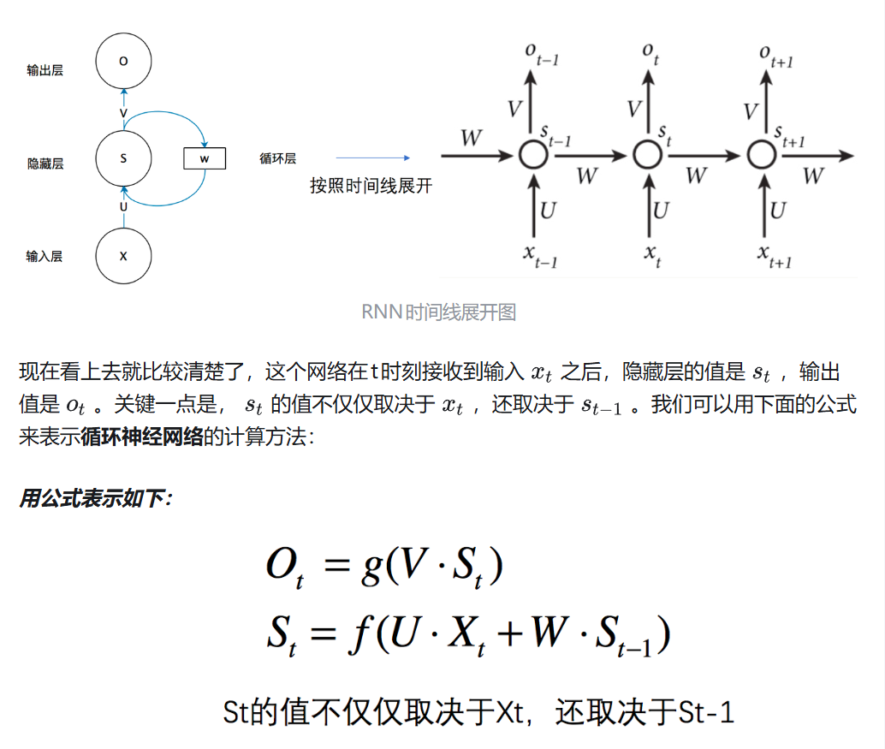

# 创建专用环境
conda create -n dl-learning python=3.10
conda activate dl-learning

# 安装PyTorch套件
conda install pytorch==2.5.1 torchvision==0.20.1 torchaudio==2.5.1 pytorch-cuda=12.1 -c pytorch -c nvidia

# RNN

### RNN在t时刻接收到输入Xt后，隐藏层的值是St，输出值是Ot。关键点是St的值不仅取决于Xt，还取决于St-1
## 循环神经网络计算方法
## St = f(U*Xt + W*St-1)  
## Ot = g(V*St)

